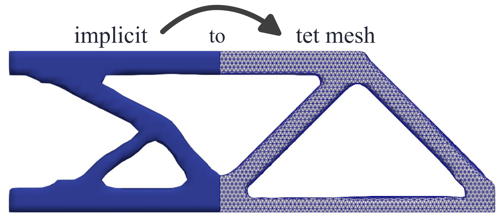
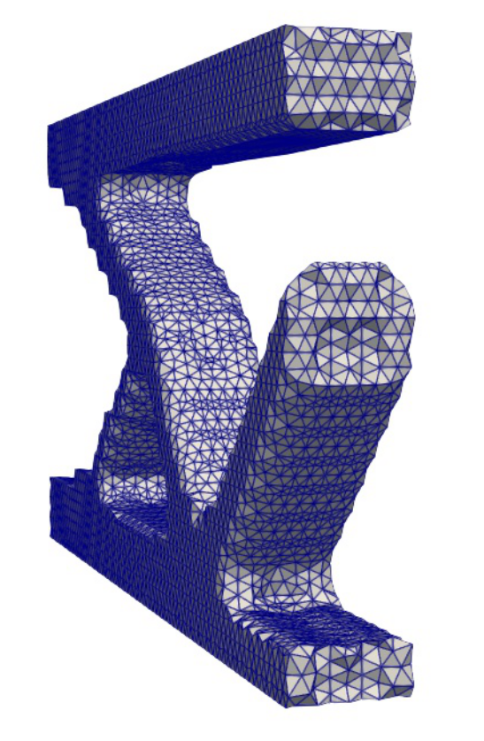
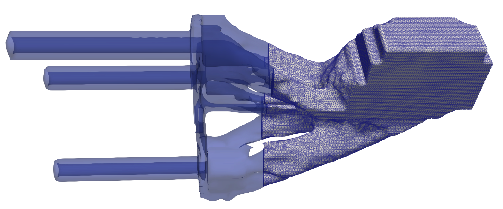

# Implicit2TetMesh.jl

Implicit2TetMesh is an experimental Julia package for generating high-quality tetrahedral meshes from implicit geometries defined by Signed Distance Functions (SDFs), inspired by [isosurface stuffing algorithm](https://dl.acm.org/doi/10.1145/1276377.1276448). Implementation details are provided in the documentation below. For practical usage examples, see [`test/Examples/`](test/Examples/).

<!-- <div style="display: flex; justify-content: center; align-items: center; gap: 10px;">
  
  
</div> -->
<p align="center">
  
</p>

## Features
- **Robust Meshing**: High-quality tetrahedral mesh generation from implicit geometries using A15 (body-centered cubic) and Schlafli (orthoscheme) discretizations
- **Isosurface Refinement**: Advanced boundary processing with experimental NZZZ case handling for thin features relative to characteristic element size
- **Volume Correction**: Precise volume preservation using automatic surface node adjustment
- **Geometric Constraints**: Bounded plane definitions for selective node alignment
- **Mesh Operations**: Slicing, isolated component removal, inverted element fixing, and VTU export with mesh quality metrics

## Installation
```julia
# From Julia REPL, press ] to enter package mode
pkg> add https://github.com/jezekon/Implicit2TetMesh.jl
```
or
```
git clone https://github.com/jezekon/Implicit2TetMesh.jl
```
## Main Function
Generate tetrahedral meshes from SDF data:
```julia
generate_tetrahedral_mesh(grid_file, sdf_file, output_prefix; options=MeshGenerationOptions())
```
#### Parameters:
- `grid_file::String`: Path to the JLD2 file containing the grid data
- `sdf_file::String`: Path to the JLD2 file containing the SDF values
- `output_prefix::String`: Prefix for output files (default: "output")
- `options::MeshGenerationOptions`: Configuration options (optional)
#### Return Value:
- `mesh::BlockMesh`: The generated tetrahedral mesh
- **Output files**: `.vtu` mesh visualization files for Paraview

### MeshGenerationOptions

Configure the mesh generation process with the following options:

```julia
MeshGenerationOptions(;
    scheme::String = "A15",                           # Discretization scheme: "A15" or "Schlafli"
    warp_param::Float64 = 0.3,                        # Warping intensity for plane alignment (0.0 = disabled)
    plane_definitions::Union{Vector{PlaneDefinition}, Nothing} = nothing,  # Cutting planes for BC application
    quality_export::Bool = false,                     # Export detailed quality metrics
    correct_volume::Bool = false,                     # Apply volume correction algorithm
    experimental_nzzz::Bool = false                   # Enable experimental NZZZ case warping
)
```
#### Option Details

- **scheme**: 
  - `"A15"`: Body-centered cubic lattice discretization (recommended for most cases)
  - `"Schlafli"`: Orthoscheme discretization (better for axis-aligned features)
- **warp_param**: Controls how strongly nodes are attracted to cutting planes (0.0-1.0 range recommended)
- **plane_definitions**: Vector of `PlaneDefinition` objects for boundary plane constraints
- **quality_export**: When `true`, exports additional quality metrics (Jacobian determinants, dihedral angles, volume ratios)
- **correct_volume**: Enables iterative volume correction to match reference SDF volume (may increase processing time)
- **experimental_nzzz**: Enables experimental warping for NZZZ cases (one node outside, three on surface). Use with caution.

### Example Usage
```julia
using Implicit2TetMesh

# Basic usage with default options
mesh = generate_tetrahedral_mesh(
    "path/to/grid_data.jld2",
    "path/to/sdf_data.jld2",
    "beam"
)
```
### Advanced Usage Examples
For complete examples with detailed documentation, see [`test/Examples/`](test/Examples/):
```julia
# Run beam example
julia --project=. test/Examples/beam.jl

julia --project=. test/Examples/gripper.jl
```
___
## TODO List
- [ ] Improve NZZZ case handling based on dihedral angles
- [ ] Add support for NNZZ cases (two nodes outside, two on surface)
- [ ] Performance optimizations for large meshes

## Acknowledgments
This package is an experimental tool. Please validate results carefully.
