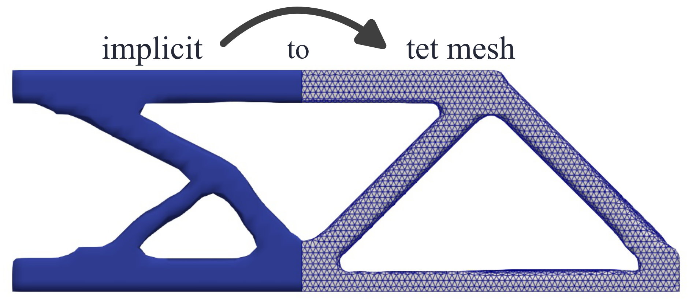
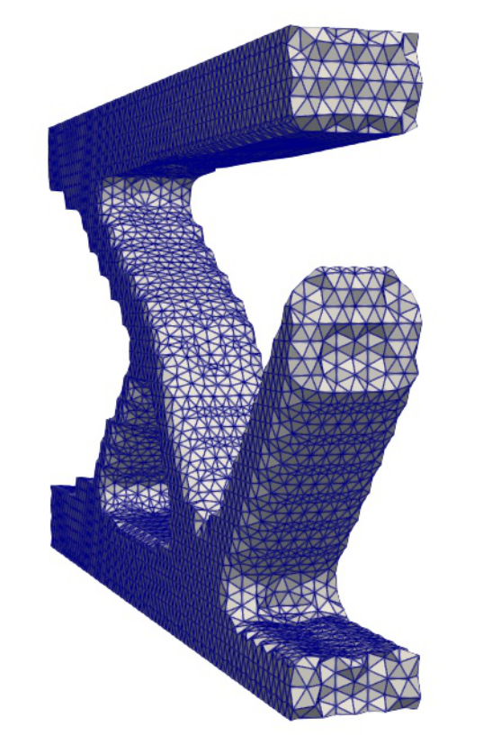
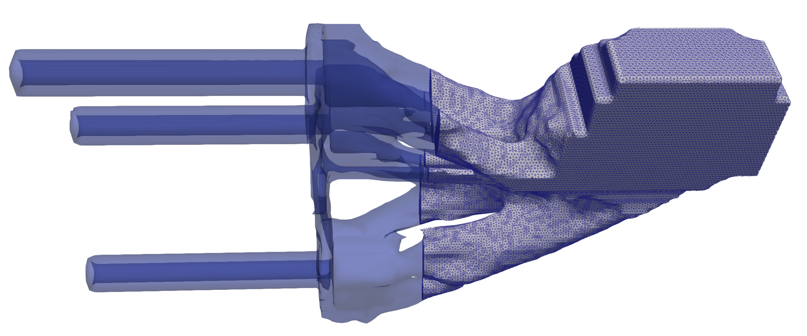

# Implicit2TetMesh.jl

Implicit2TetMesh is an experimental Julia package for generating high-quality tetrahedral meshes from implicit geometries defined by Signed Distance Functions (SDFs), inspired by [isosurface stuffing algorithm](https://dl.acm.org/doi/10.1145/1276377.1276448). Implementation details are provided in the documentation below. For practical usage examples, see [`examples/`](examples/).

<!-- <div style="display: flex; justify-content: center; align-items: center; gap: 10px;">
  
  
</div> -->
<p align="center">
  
</p>

## Features
- **Robust Meshing**: High-quality tetrahedral mesh generation from implicit geometries on an A15 (body-centered cubic) acute lattice
- **Edge-based Warping**: Lattice vertices near the surface are snapped onto the linear cut points of sign-crossing edges (isosurface-stuffing warp), which collapses the sliver tetrahedra
- **Boundary Trimming**: Tetrahedra crossing the surface are trimmed back to the interior with quartet-style `trim_spikes` stencils; a consistent quad-split diagonal keeps the trimmed boundary crack-free. Surface-only ("quadruple-zero") tetrahedra are resolved with Labelle's §3.4 heuristic, which removes bubbles at the trimming stage instead of relying on a global cleanup pass
- **Exact Geometric Predicates**: Every tetrahedron orientation/inversion decision uses Shewchuk's exact predicates (via [ExactPredicates.jl](https://github.com/lairez/ExactPredicates.jl)) instead of a tolerance-thresholded determinant, so the sign of each element is decided robustly and the output is guaranteed free of inverted elements
- **Geometric Constraints**: Bounded plane definitions for selective node alignment
- **Mesh Operations**: Slicing, isolated component removal, inverted element fixing, and VTU export with mesh quality metrics
- **Pluggable Input Fields**: structured SDF grids (trilinear) *and* unstructured conforming HEX8 finite-element fields (isoparametric shape functions) behind one interface, with SIMP-density and level-set adapters; the generation lattice stays structured by design
- **Optional Gated Relaxation**: an opt-in post-pass (default OFF) that improves the near-boundary element layer without changing topology — either equalizing element sizes (DistMesh springs) or lifting the worst dihedral angles (quartet-style maximin smoothing). A two-sided quality gate makes it safe by construction: an accepted move never sharpens the smallest dihedral nor widens the largest, and surface nodes stay exactly on the zero level set

## Installation

**Requirements:** Julia LTS (1.10.10)
```julia
# From Julia REPL, press ] to enter package mode
pkg> add https://github.com/jezekon/Implicit2TetMesh.jl
```
or
```
git clone https://github.com/jezekon/Implicit2TetMesh.jl
```
## Main Function
Generate tetrahedral meshes from SDF data:
```julia
generate_tetrahedral_mesh(grid_file, sdf_file, output_prefix; options=MeshGenerationOptions())
```
#### Parameters:
- `grid_file::String`: Path to the JLD2 file containing the grid data
- `sdf_file::String`: Path to the JLD2 file containing the SDF values
- `output_prefix::String`: Prefix for output files (default: "output")
- `options::MeshGenerationOptions`: Configuration options (optional)
#### SDF Convention:
The package uses the standard convention `phi < 0 = inside`, `phi > 0 = outside`, `phi = 0 = on the surface`, matching the isosurface-stuffing reference implementations. Input files that store the opposite sign (positive = inside) are negated automatically when the `BlockMesh` is constructed; the data files on disk are never modified.
#### Surface Warping:
Before the boundary is sliced, lattice vertices close to the surface are snapped onto the **linear cut points** of their sign-crossing edges, following the isosurface-stuffing warp (Labelle 2007, §3.2). For every tetrahedron edge whose endpoints have opposite SDF signs, the surface crosses the edge at `X_i + α·(X_j − X_i)` with `α = φ_i / (φ_i − φ_j)`; if that crossing lies within a fraction `threshold` (default `0.3`) of an endpoint, the endpoint is moved onto it and marked as lying on the surface. Each vertex is warped to its closest qualifying cut point, and all displacements are computed from the original geometry and applied at once, so the result is independent of vertex order. Snapping to the *linear* cut point (rather than projecting each node to the true isosurface) is what keeps the surrounding tetrahedra well shaped and removes the slivers.
#### Surface Tetrahedron Handling:
After trimming, some tetrahedra end up with **all four vertices on the surface** (every node was warped onto a cut point). These "quadruple-zero" tetrahedra are ambiguous — it is not clear whether each one lies inside or outside the geometry — so they are resolved with the principled heuristic of Labelle 2007 (§3.4) rather than a single centroid test:

1. A candidate that is **inverted**, or whose **dihedral angles** fall outside `[10°, 140°]`, is discarded — it is too flat to improve surface fidelity.
2. Of the well-shaped survivors, the number of faces that **adjoin the interior mesh** decides the outcome: all four faces adjoin → **retain** (the tetrahedron fills a pocket in the boundary); no face adjoins → **discard** (an isolated "bubble"); otherwise the **SDF sign at the centroid** decides (inside → keep).

Because bubbles are removed here, the global `remove_isolated_components!` pass that follows is now only a safety net (it keeps the largest connected component for geometries that split into disconnected pieces). Where four warped vertices lie on a sub-lattice-thickness thin feature, the boundary can still self-touch (two surface sheets meeting along an edge); such pinches reflect the uniform lattice resolution and are the target of the planned adaptive refinement, not cracks — the trimmed boundary stays free of open (hole) edges.
#### Volume Accuracy:
The mesh volume is an honest discretization of the zero isosurface. Because the boundary is approximated by flat triangles, the meshed volume is slightly smaller than the reference SDF volume wherever the isosurface is curved (about 2.7 % on the beam, 0.4 % on the gripper); this gap shrinks as the lattice is refined, not by moving nodes after meshing.

The package therefore applies **no** post-hoc volume correction. Displacing surface nodes onto a single global SDF level after meshing is equivalent to meshing the `phi = c` isocontour, but done crudely — it degrades the surface fidelity the warp establishes and can produce spiked or inverted elements (the quartet / Labelle reference algorithms have no such step). If an exact target volume is ever required (for example a volume fraction carried over from topology optimization), the recommended approach is to choose the iso-level offset `c` by bisection **before** meshing and run the normal pipeline on the shifted field `phi − c`. That keeps the mesh robust (no spikes or inversions) and preserves the full surface-fidelity guarantee.
#### Geometric Robustness:
All tetrahedron orientation and inversion decisions use **exact geometric predicates** (Shewchuk's adaptive-precision `orient3d`, via [ExactPredicates.jl](https://github.com/lairez/ExactPredicates.jl)) rather than a floating-point determinant compared against a hand-tuned tolerance. The sign of each element's signed volume is therefore decided exactly: there is no threshold to guess, a single shared predicate backs every orientation check in the pipeline, and the final mesh is guaranteed to contain no inverted elements. A tolerance is kept in exactly one place — to drop genuinely degenerate (near-zero-volume) elements — where it gates the volume *magnitude*, never the sign. `ExactPredicates` is a standard dependency (listed in `Project.toml`) and is installed automatically.
#### Return Value:
- `mesh::BlockMesh`: The generated tetrahedral mesh
- **Output files**: `.vtu` mesh visualization files for Paraview

### MeshGenerationOptions

Configure the mesh generation process with the following options:

```julia
MeshGenerationOptions(;
    scheme::String = "A15",                           # Discretization scheme (only "A15" is supported)
    warp_param::Float64 = 0.3,                        # Warping intensity for plane alignment (0.0 = disabled)
    plane_definitions::Union{Vector{PlaneDefinition}, Nothing} = nothing,  # Cutting planes for BC application
    quality_export::Bool = false,                     # Export detailed quality metrics
    cut_points::Symbol = :linear,                     # Surface cut-point location: :linear or :bisection
    relax::Union{RelaxOptions, Nothing} = nothing     # Optional relaxation post-pass (nothing = OFF)
)
```
#### Option Details

- **scheme**: `"A15"` — body-centered cubic acute lattice (the only supported scheme)
- **warp_param**: Controls how strongly nodes are attracted to cutting planes (0.0-1.0 range recommended)
- **plane_definitions**: Vector of `PlaneDefinition` objects for boundary plane constraints
- **quality_export**: When `true`, exports additional quality metrics (Jacobian determinants, dihedral angles, volume ratios)
- **cut_points**: How the surface cut point on a sign-crossing lattice edge is located, in both the warp and the slicing stage. `:linear` (default) estimates it from the two endpoint SDF values, exactly like the quartet reference implementation — accurate when the input is a true signed distance function. `:bisection` finds the actual zero of the interpolated field along the edge (Labelle & Shewchuk 2007, §3.1); use it when the input field is *not* distance-like (e.g. a smoothed SDF), where the linear estimate misplaces surface vertices and flat walls come out dented.
- **relax**: An optional [`RelaxOptions`](#mesh-relaxation-optional-post-pass) that enables the gated relaxation post-pass. `nothing` (default) leaves it OFF and the output is unchanged. The pass runs on the final mesh, after connectivity and before any plane cutting.

### Example Usage
```julia
using Implicit2TetMesh

# Basic usage with default options
mesh = generate_tetrahedral_mesh(
    "path/to/grid_data.jld2",
    "path/to/sdf_data.jld2",
    "beam"
)
```
### Advanced Usage Examples
For complete examples with detailed documentation, see [`examples/`](examples/):
```julia
# Run beam example
julia --project=. examples/beam.jl

julia --project=. examples/gripper.jl
```
___
## Input Field Sources

By default the field comes from a structured SDF grid (the `grid_file` / `sdf_file` above). Internally the mesher reads the field through a **single query**, `eval_sdf`, so the field source is *pluggable*: the same pipeline (lattice fill, warp, trimming, connectivity) meshes either kind of input. The **generation lattice itself always stays structured** — that is a property of isosurface stuffing; only the *source* of the field changes.

Two concrete sources implement the `eval_sdf(source, p)` + `bbox(source)` interface:

- **`StructuredSDF`** — a uniform grid with **trilinear** interpolation. This is the reference path; it reproduces the original behaviour bit-for-bit and is the fast path the auto-detector falls back to.
- **`UnstructuredSDF`** — a conforming 8-node hexahedral (**HEX8**) finite-element mesh. The field at a query point is the isoparametric **trilinear shape-function** interpolation of the nodal values: point location uses a uniform spatial hash over element bounding boxes, and the element's isoparametric map is inverted by Newton iteration to recover the natural coordinates `(ξ, η, ζ)`. A point outside the meshed region returns a positive (exterior) value — the distance to the domain box — which keeps the zero isosurface enclosed.

  **Conforming-mesh requirement.** The HEX8 mesh must be conforming (no hanging nodes) and have positive Jacobians. On a conforming mesh the restriction of the trilinear field to a shared face depends only on the four shared face nodes, so the field is C0-continuous and the zero isosurface is crack-free — the same property the structured trilinear path has. (Per-element interpolation without shared-face consistency would re-introduce the diagonal-choice cracking problem.) The Jacobian sign and index ranges are validated when the source is built.

Because the edge warp uses the scale-invariant cut fraction `α = φ_i / (φ_i − φ_j)` and no gradients, the field only needs the right zero set and the sign near it — it does **not** have to be a true signed distance function, so SIMP density fields and level sets qualify.

### Meshing an unstructured field

Build a source, sample it onto a structured generation lattice with `BlockMesh(source; dx, padding)`, then run the same pipeline through the source-agnostic entry point:

```julia
src  = build_sdf_source(nodes, hexes, nodal_phi)   # auto: grid -> StructuredSDF, else UnstructuredSDF
mesh = BlockMesh(src; dx = 1.0, padding = 2)        # structured lattice over bbox(src) + a padding ring
mesh = generate_tetrahedral_mesh(mesh, "part")      # same pipeline, same output contract
```

- `build_sdf_source(nodes, hexes, nodal_phi; force = :auto, grid_tol = nothing)` picks the source: a uniform tensor-product grid is recognised and built as a `StructuredSDF` (fast path); anything else becomes an `UnstructuredSDF`. `force = :structured` / `:unstructured` overrides the auto-detection.
- `BlockMesh(source; dx, padding = 2)` builds the structured lattice from `bbox(source)` grown by a `padding`-cell ring, with uniform spacing `dx`, caching `eval_sdf(source, ·)` at each lattice corner (the padding ring reads as exterior).

### Adapters

Two adapters convert common topology-optimization inputs to the `phi < 0 = inside` convention:

- **SIMP densities** — `simp_to_sdf_source(nodes, hexes, densities; iso_level = 0.5)`: element-constant densities are averaged to the nodes (volume-weighted over the incident elements) and turned into `phi = iso_level − ρ`, so `phi < 0` exactly where the smoothed density exceeds `iso_level` (solid). `iso_level` defaults to the usual `0.5` threshold and is adjustable.
- **Level set** — `levelset_to_sdf_source(nodes, hexes, nodal_values; inside = :negative)`: a nodal level-set field used directly; `inside` states the input sign convention (`:negative` = already negative inside, used as is; `:positive` = positive inside, negated) so the stored field ends up `phi < 0 = inside`.

> **Verification note.** quartet can only consume structured grids, so there is no cross-validation oracle for unstructured inputs. The unstructured path is instead checked by a **round-trip** (the beam field re-expressed as a HEX8 mesh and forced through the FE path reproduces the structured run within floating-point tolerance) and by watertightness + quality on a genuinely unstructured analytic case — see `test/test_sdf_sources.jl`.

___
## Mesh relaxation (optional post-pass)

The A15 interior is already uniform and near-optimal by construction — essentially **all** element-size variance and bad dihedral angles live in the one-to-two element layers that the warp and trim steps create near the boundary. An optional, **default-OFF** post-pass improves exactly that layer. It only **moves vertices** (fixed topology — never a flip, collapse, or insertion), so the watertight trim structure, the node indices, and determinism all survive. Enable it by passing a `RelaxOptions` to `MeshGenerationOptions(relax = …)`, or call `relax_mesh!(mesh, opts)` directly on a finished mesh.

```julia
# Equalize element sizes near the boundary (DistMesh springs)
opts = MeshGenerationOptions(relax = RelaxOptions(mode = :uniform))
mesh = generate_tetrahedral_mesh(grid_file, sdf_file, "beam"; options = opts)

# Or lift the worst dihedral angles (quartet-style maximin smoothing)
opts = MeshGenerationOptions(relax = RelaxOptions(mode = :quality))
```

**Two modes, one skeleton.** Every update *proposes* a new position, *gates* it on local element quality, and *projects* surface vertices back onto the surface. The modes differ only in the proposal:

- **`:uniform`** — a DistMesh size-equalizing spring force `d_v = ω·Σ_j (x_j − x_v)(1 − L₀/|e_vj|)` (Persson & Strang 2004). Short edges push, long edges pull; the equilibrium is uniform edge lengths. `L₀` is the median active-band edge length.
- **`:quality`** — quartet's maximin smoothing (`optimize_tet_mesh.cpp`), done **deterministically** (a fixed candidate pattern around each vertex instead of quartet's random perturbations). It moves the vertex to the position that maximizes the minimum sine-of-dihedral over its incident tets.

**The gate makes safety a construction, not a hope.** A candidate is accepted only if, over every incident tetrahedron, (a) the element stays positively oriented (the same **exact** predicate the pipeline uses), (b) the sharpest dihedral does not get sharper **and** the widest does not get wider (a two-sided check on the dihedral cosines), and (c) interior vertices stay strictly inside (`eval_sdf < 0`). The current position always competes, so an accepted move never worsens either dihedral tail. The hard, testable consequences: **the minimum dihedral never drops, the maximum dihedral never grows, and the element count is unchanged.**

**Surface nodes stay on `phi = 0`.** A surface proposal is projected into the tangent plane and then re-projected onto the zero level set by **bisection along the angle-weighted vertex pseudo-normal** (Thürmer–Wüthrich / Bærentzen–Aanæs), with the bracket clamped to half the local edge length so a thin wall's opposite sheet is never reached. The search direction is the pseudo-normal, **never the SDF gradient** (which is invalid for the SIMP / level-set fields this mesher accepts). This is **not** the removed post-hoc volume correction: it never moves a node off the zero level, so the volume-accuracy contract above is untouched; the volume changes only by chord redistribution.

Measured on the test geometries (mode `:uniform`, default settings):

| geometry | min dihedral | max dihedral | angles < 10° | angles > 140° |
|----------|:---:|:---:|:---:|:---:|
| beam     | 11.28° → **18.37°** | 153.21° → **131.62°** | 0 → 0 | 81 → **0** |
| gripper  | 9.54° → **12.35°**  | 155.36° → **149.85°** | 11 → **0** | 1136 → **91** |

**Options (`RelaxOptions`).** All defaults are starting points meant to be tuned while measuring.

```julia
RelaxOptions(;
    mode::Symbol      = :uniform,   # :uniform (springs) or :quality (maximin)
    max_sweeps::Int   = 10,         # max Gauss-Seidel sweeps over the active set
    band::Int         = 2,          # active set = surface vertices + `band` rings inward
    omega::Float64    = 0.3,        # spring step factor (:uniform)
    sizing::Symbol    = :uniform,   # :uniform (one L₀) or :curvature (per-vertex L₀)
    alpha::Float64    = 0.5,        # curvature sizing scale: target length ~ alpha / curvature
    h_min::Float64    = 0.0,        # curvature target clamp (0 = auto, 0.5·grid_step)
    h_max::Float64    = 0.0,        # curvature target clamp (0 = auto, 4·grid_step)
    grading::Float64  = 0.3,        # gradient-limit bound g for curvature sizing (Persson 2006)
    frozen::Vector{Int} = Int[],    # node indices never moved (functional-surface hook)
    bisection_tol::Float64 = 1e-7,  # |eval_sdf| tolerance for the surface re-projection
)
```

- **`band`** keeps the work near the boundary, where the defects are; the interior is left untouched. A very large value (e.g. `typemax(Int)`) relaxes every vertex (experiment-only).
- **`sizing = :curvature`** (only meaningful for `mode = :uniform`) concentrates elements where the surface bends: a per-vertex target length `clamp(alpha / curvature, h_min, h_max)`, gradient-limited over the active-band edge graph so neighbouring targets differ by at most `g·edge_length` (Persson 2006). With fixed topology this yields only **mild** concentration (edge ratios ~1.5–2×), not true refinement — real refinement is the planned adaptive octree.
- **`frozen`** is the forward-compatible hook for protecting functional (boundary-condition) surfaces from being moved.

The pass is deterministic (fixed-order sweeps, fixed candidate patterns, no `rand`), so a relaxed mesh can be frozen as a regression baseline. Cost is roughly **~1 s on the beam** and **~12–15 s on the gripper** (whose thin walls put ~⅔ of all nodes inside the band-2 active set); the quartet cross-validation oracle is only ever compared with relaxation OFF.

___
## Testing
The test suite is assertion-based. It combines **invariant** tests — properties every correct
output must satisfy (watertight boundary, no inverted elements, a single connected component,
node-SDF consistency, positive element volumes) — with **baseline** (regression) tests that pin
exact node/tet counts and the dihedral-angle histogram. The pipeline is deterministic, so the
frozen baselines in `test/helpers/baselines.jl` are an exact, sharp check; an intentional pipeline
change re-freezes that single file.

```bash
# Default run (beam geometry; the fast path)
julia --project=. -e 'using Pkg; Pkg.test()'

# Opt in to the large gripper geometry (slow)
I2TM_TEST_GRIPPER=1 julia --project=. -e 'using Pkg; Pkg.test()'
```

A per-stage beam diagnostic (`test/test_beam_stages.jl`, also runnable standalone with
`julia --project=. test/test_beam_stages.jl`) exports the mesh to a VTU after every pipeline phase,
so a broken stage is named by the failing assertion and can be inspected in ParaView. All test VTU
artifacts are written to `test/output/` (git-ignored). Shared check helpers and the frozen
baselines live under `test/helpers/`.

## TODO List
- [x] Principled surface-tetrahedron (quadruple-zero) handling per Labelle §3.4
- [x] Optional gated mesh relaxation post-pass (fixed topology): uniform-sizing "spring" mode and quartet-style quality-optimization mode, surface nodes kept on the zero level set
- [ ] Optional adaptive refinement for thin features (sub-lattice-thickness walls)
- [ ] Performance optimizations for large meshes

## Acknowledgments
This package is an experimental tool. Please validate results carefully.
